## Changes in Vendor files

### create new php file for line provider becasue soiallite package won't support lineprovider

#### first ```createLineDriver()``` funtion in ```SocialiteManager.php```

vendor/laravel/socialite/src/SocialiteManager.php

```
<?php
/**
 * Create an instance of the specified driver.
 *
 * @return \Laravel\Socialite\Two\AbstractProvider
 */
protected function createLineDriver()
{
    $config = $this->app['config']['services.line'];

    return $this->buildProvider(
        'Laravel\Socialite\Two\LineProvider', $config
    );
}
```
#### and create ```LineProvider.php```

vendor/laravel/socialite/src/Two/LineProvider.php

```
<?php

namespace Laravel\Socialite\Two;

use Exception;
use Illuminate\Support\Facades\Http;
use Illuminate\Support\Arr;

class LineProvider extends AbstractProvider implements ProviderInterface
{
    /**
     * The scopes being requested.
     *
     * @var array
     */
    protected $scopes = ['profile', 'openid', 'email'];

    /**
     * {@inheritdoc}
     */
    protected function getAuthUrl($state)
    {
        $this->request->session()->put('provider', 'line');
        $nonce = bin2hex(random_bytes(16));
        $baseAuthUrl = 'https://access.line.me/oauth2/v2.1/authorize/consent';

        $query = http_build_query([
            'response_type' => 'code',
            'client_id' => $this->clientId,
            'redirect_uri' => $this->redirectUrl,
            'state' => $state,
            'scope' => implode(' ', $this->scopes),
            'nonce' => $nonce,
        ]);
    
        return "{$baseAuthUrl}?{$query}";
    }
    

    /**
     * {@inheritdoc}
     */
    protected function getTokenFields($code)
    {
 
        $authorizationCode = $code;
        $redirectUri = $this->redirectUrl;
        $clientId = $this->clientId;
        $clientSecret = $this->clientSecret;
        $codeVerifier = 'wJKN8qz5t8SSI9lMFhBB6qwNkQBkuPZoCxzRhwLRUo1'; // generate random

        return [
            'grant_type' => 'authorization_code',
            'code' => $authorizationCode,
            'redirect_uri' => $redirectUri,
            'client_id' => $clientId,
            'client_secret' => $clientSecret,
            'code_verifier' => $codeVerifier,
        ];
    }

    /**
     * {@inheritdoc}
     */
    protected function getTokenUrl()
    {

        return 'https://api.line.me/oauth2/v2.1/token';
    }

    /**
     * {@inheritdoc}
     */
    protected function getUserByToken($token)
    {

        $verifyUrl = 'https://api.line.me/oauth2/v2.1/verify';
    
            $verifyData = [
                'id_token' => $token,
                'client_id' => $this->clientId,
            ];
            
            $ch = curl_init();
            curl_setopt($ch, CURLOPT_URL, $verifyUrl);
            curl_setopt($ch, CURLOPT_RETURNTRANSFER, true);
            curl_setopt($ch, CURLOPT_POST, true);
            curl_setopt($ch, CURLOPT_POSTFIELDS, http_build_query($verifyData));
            curl_setopt($ch, CURLOPT_HTTPHEADER, ['Content-Type: application/x-www-form-urlencoded']);
            
            $response = curl_exec($ch);
            $userInfo = json_decode($response, true);
            
            curl_close($ch);
            return $userInfo;

    }

    /**
     * {@inheritdoc}
     */
    protected function mapUserToObject(array $user)
    {

        return (new User)->setRaw($user)->map([
            'id' => $user['sub'],
            'name' => $user['name'],
            'email' => $user['email'],
            'avatar' => $user['picture'],
        ]);
    }

    /**
     * Get the default options for an HTTP request.
     *
     * @return array
     */
    protected function getRequestOptions($token)
    {
        return [
            'headers' => [
                'Authorization' => 'Bearer '.$token,
            ],
        ];
    }
}

```
#### call the ```SocialiteServiceProvider``` in the ```config/app.php```

```
<?php
// ...

'providers' => [
    // Other service providers...

    Laravel\Socialite\SocialiteServiceProvider::class,
],

// ...
```

```
<?php

// ...

'aliases' => [
    // Other aliases...

    'Socialite' => Laravel\Socialite\Facades\Socialite::class,
],

// ...
```

Add credentials to `config/services.php`:

```
<?php

// ...

'line' => [
    'client_id' => env('LINE_CHANNEL_ID'),
    'client_secret' => env('LINE_CHANNEL_SECRET'),
    'redirect' => env('LINE_CALLBACK_URL'),
],

// ...
```

#### in `vendor\laravel\socialite\src\Two\AbstractProvider.php` we have to make a little changes in `user()` function

```
    /**
     * {@inheritdoc}
     */
    public function user()
    {
        if ($this->user) {
            return $this->user;
        }

        if ($this->hasInvalidState()) {
            throw new InvalidStateException;
        }

        $response = $this->getAccessTokenResponse($this->getCode());

        if($this->request->session()->pull('provider') == 'line') {
            $token = Arr::get($response, 'id_token');
            $this->request->session()->put('provider', null );
        } else {
            $token = Arr::get($response, 'access_token');
        }
        
        $this->user = $this->mapUserToObject($this->getUserByToken($token));

        return $this->user->setToken($token)
                    ->setRefreshToken(Arr::get($response, 'refresh_token'))
                    ->setExpiresIn(Arr::get($response, 'expires_in'))
                    ->setApprovedScopes(explode($this->scopeSeparator, Arr::get($response, 'scope', '')));
    }
    
```


This completes the preparations for implementing LINE Login on Socialite.

## Now we have to create https:// secure type becuase some social site only allow to secure link 

#### Ngrok cmd-line tool

1.  Download Ngrok:
    Visit the official ngrok website [ngrok](https://ngrok.com/) and sign up for an account if needed. Once signed up, you can download the ngrok command-line tool.

2.  Unzip Ngrok:
    Unzip the downloaded ngrok archive to a directory of your choice.

3.  Authentication:
    Open a terminal or command prompt and navigate to the directory where you unzipped ngrok. Authenticate your account using the following command, replacing YOUR_AUTH_TOKEN with your actual ngrok auth token:

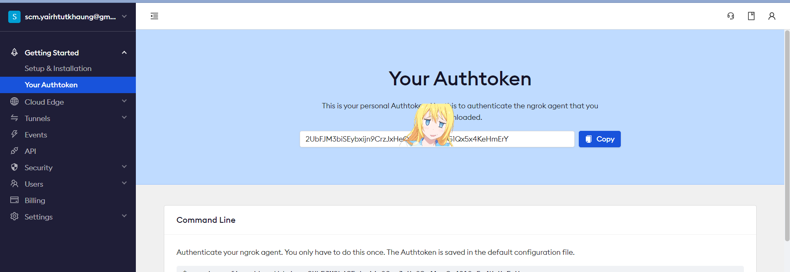

sample path
```
D:\ngrok-v3-stable-windows-amd64> ngrok authtoken YOUR_AUTH_TOKEN
```
4. Access the Secure URL :

* note : connect vpn first and run ngork because i am using font awesome icon which need vpn to loadup

```
ngrok http 8000
```
and you should get the https:// secure link of your localhost

Once ngrok is running, it will provide you with a unique secure URL https://something.ngrok.io that you can use to access your local server. This URL will be updated every time you restart ngrok, so be sure to check the terminal for the current URL after running the ngrok http command.


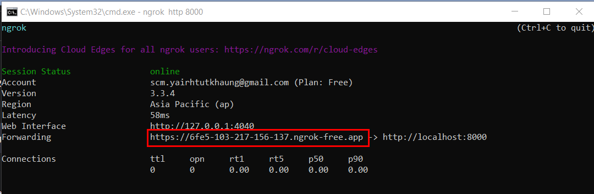

after the setup that i will show below and run `php artisan serve` and paste the copyied link in the browser url should load up the main page


#### To set up  `[client ID]`, `[client Channel Secret]`, and `[Callback URL]` in `.env` file you need to created developer account of each `twitter`, `line`, `facebook`, `google`, `github`. I put .env.example to see where to put

## Twitter Developer Account Setup

[Twitter Developer](https://developer.twitter.com/en) create developer account

[Twitter Developer Dashboard](https://developer.twitter.com/en/portal/dashboard) then in here choose free account

put this Data protection of your usecase in the box

```
In accordance with data protection regulations, we are pleased to provide a comprehensive overview of our intended use cases for Twitter's data and API. These applications align with our commitment to responsible data utilization and user privacy:

Real-time Trend Analysis: We employ Twitter's API to analyze real-time trends and conversations, allowing us to stay current with industry developments without compromising individual user information.

Audience Engagement: Utilizing Twitter data, we personalize content and engagement strategies to match trending topics and sentiment, while always respecting user privacy.

Customer Insights: By leveraging Twitter's API, we analyze customer sentiment towards our products and services. This data aids in enhancing user experiences while safeguarding sensitive information.

Influencer Identification: Twitter's data assists us in identifying relevant influencers and thought leaders. Collaboration with these individuals enhances brand visibility without infringing on personal data rights.

Competitor Analysis: We use Twitter's API to monitor competitors' social media strategies, extracting insights without compromising user confidentiality.

Crisis Management: Twitter data aids in monitoring public sentiment and addressing concerns promptly. This enables effective crisis management while ensuring user data remains secure.

Personalized User Engagement: Leveraging Twitter's API, we enhance user interactions by tailoring responses and content recommendations, while adhering to strict privacy measures.
```

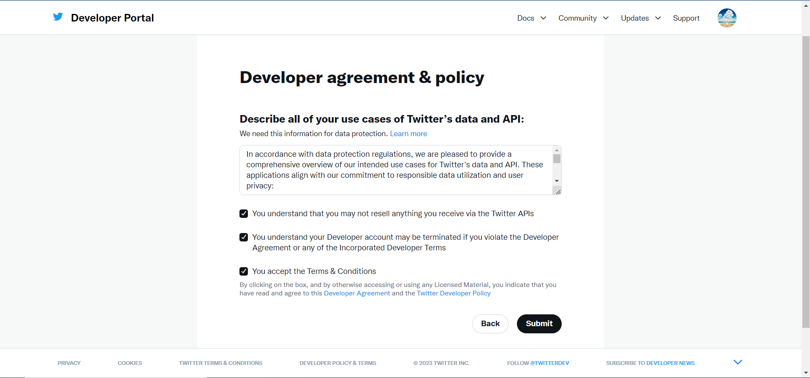

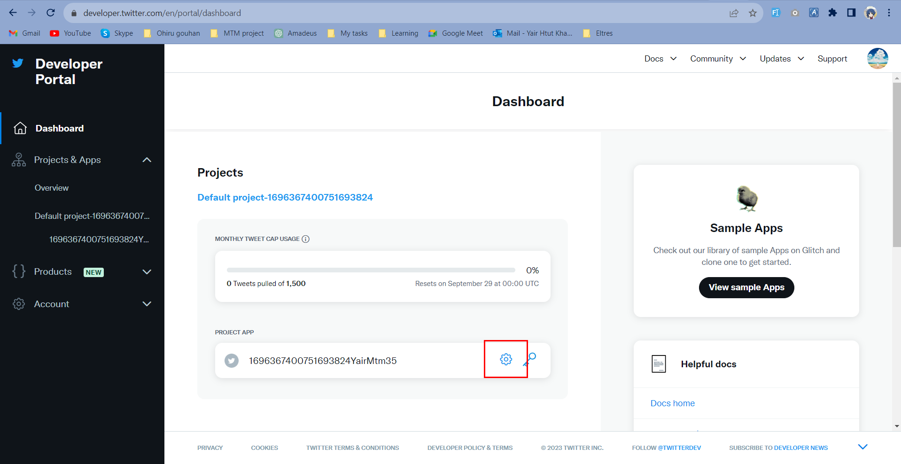
### Setup App Details

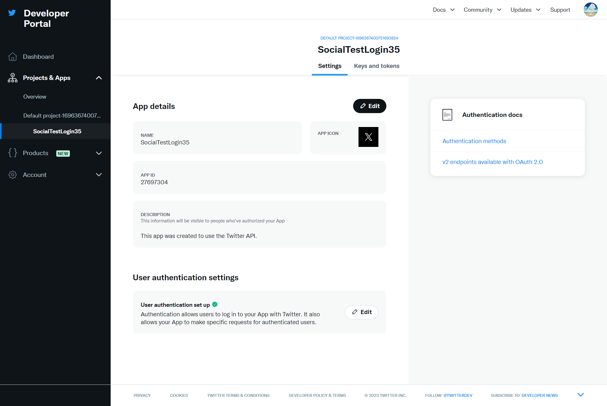

#### edit `user authentication settings` with the `secure url of ngrok` that you have created

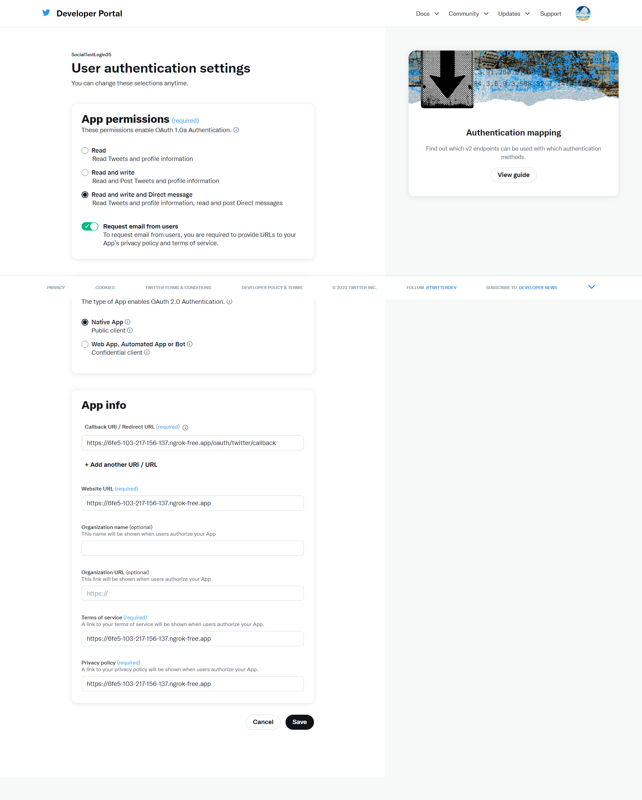

#### `regenerate client secret` again and copy

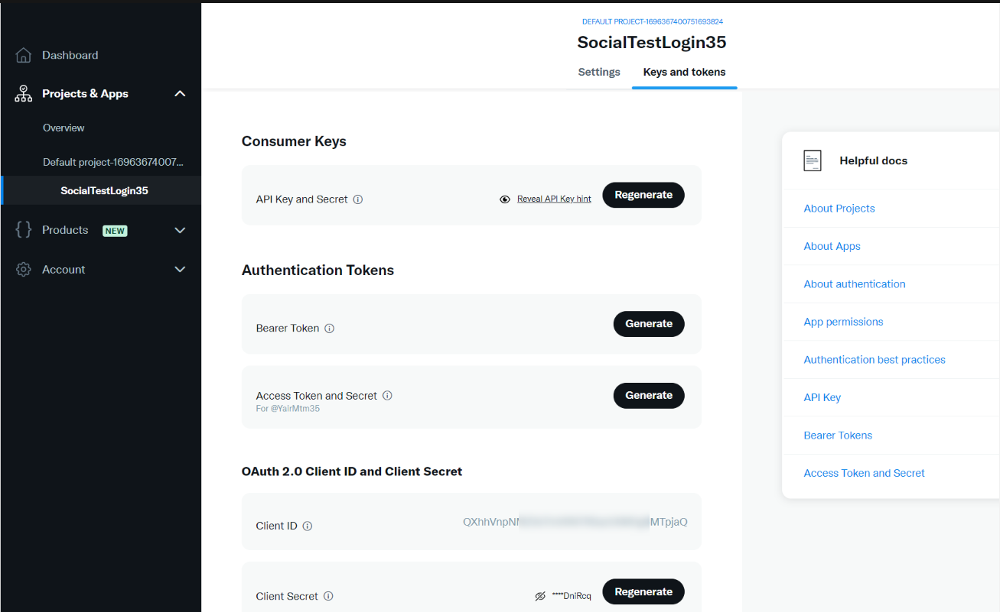

#### now you should be able to paste in `.env` 

```
TWITTER_CLIENT_ID="YOUR_CLIENT_ID"
TWITTER_CLIENT_SECRET="YOUR_CLIENT_SECRET"
TWITTER_REDIRECT="YOUR_CALLBACK" 
```


# Line Developer Account Setup

login in [Line Developer](https://developers.line.biz/en/) and  go to [console](https://developers.line.biz/console/)

click provider create button and name your app then choose `Create a LINE login channel`

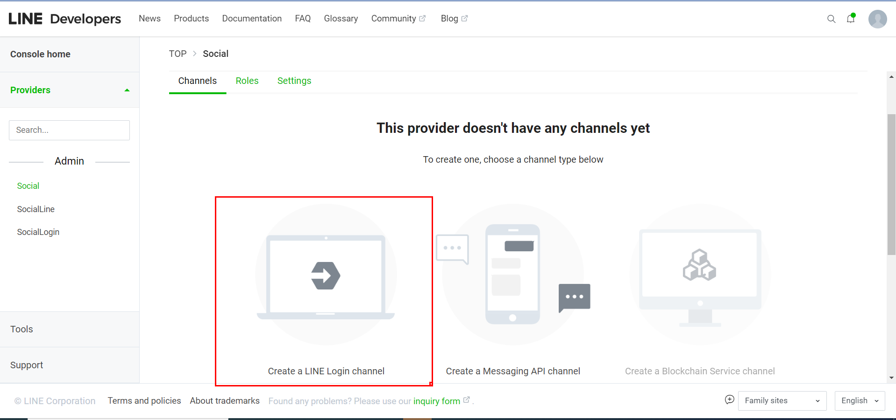

#### Channel setup

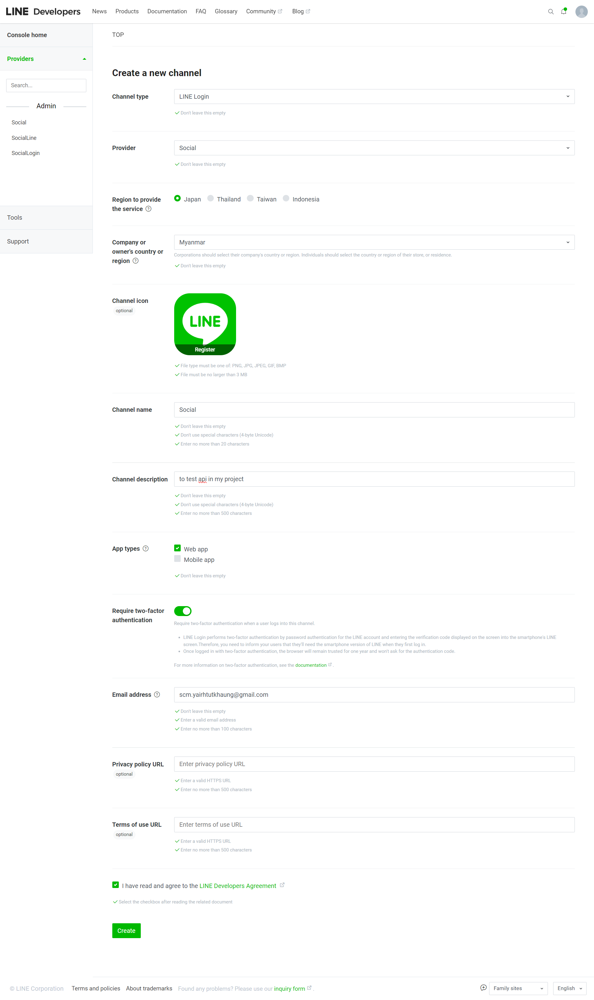


#### remember to verified OpenId Connect to able to access User Email

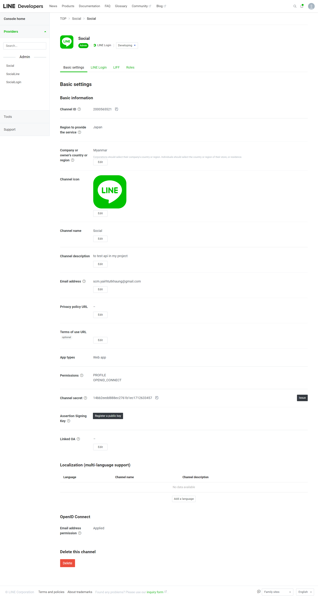

#### insert Your_Callback_Url

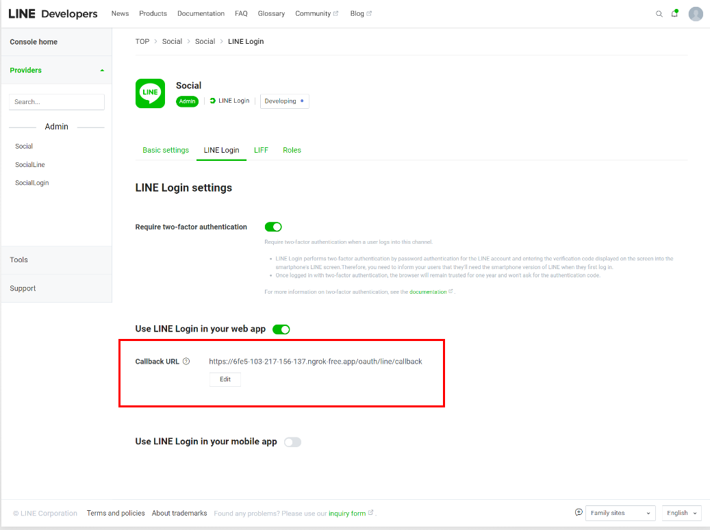

#### now make it to publish

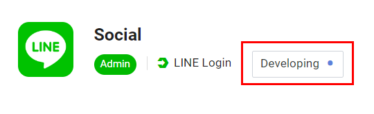

### now you have `[Channel Id]`, `[Channel Secret]` and `[Callback Url]` then put it in the `.env`

```
LINE_CHANNEL_ID="YOUR_CHANNEL_ID"
LINE_CHANNEL_SECRET="YOUR_CHANNEL_SECRET"
LINE_CALLBACK_URL="YOUR_CALLBACK_URL"
```

# Facebook Developer Account Setup

open [facebook developer account](https://developers.facebook.com/) and click `My Apps` ( you may need to connect vpn in the whole process of facebook ) and `create app`

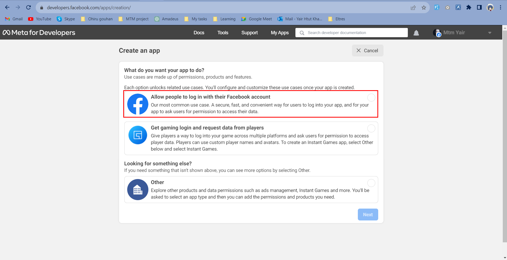

#### copy App id and App Secret here

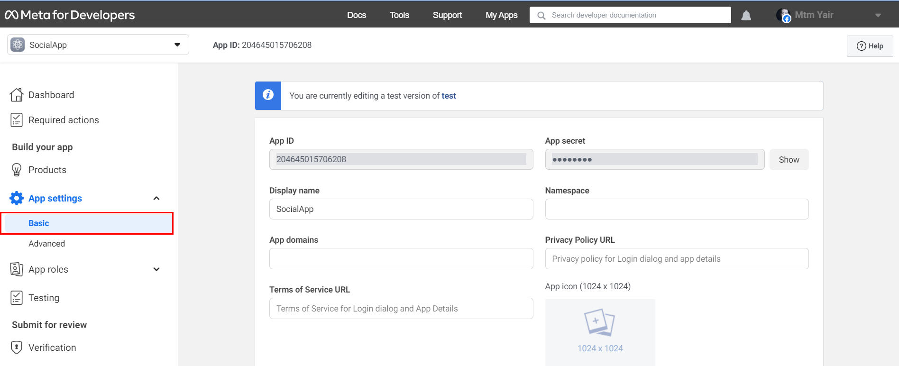

#### put your call back in the `Valid Oauth Redirect Url` and `Save changes`


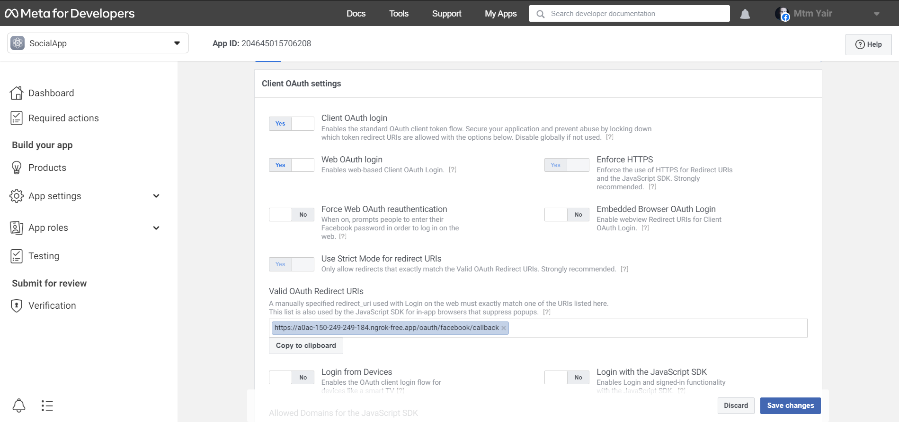

### now you have `[App Id]`, `[App Secret]` and `[Callback Url]` then put it in the `.env`

```
FACEBOOK_CLIENT_ID="YOUR_APP_ID"
FACEBOOK_CLIENT_SECRET="YOUR_APP_SECRET"
FACEBOOK_CALLBACK_URL="YOUR_CALLBACK_URL"
```
# Google Developer Account Setup

create [developer account](https://console.cloud.google.com/welcome) and click `New Project` and set the `project name` and create

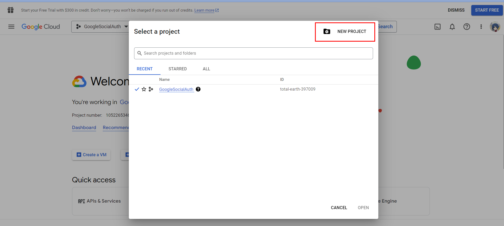


after create project you should now see my project `GoogleSocialAuth` for me in the photo `click` that and click `APIs & Services` in the screen that is also can be see on the photo

### click Oauth consent screen from left toggle bar

#### 1. Oauth consent screen

fill all the field `App name`, `User support email`, `Developer contact information` and other are optiomal and click `SAVE AND CONTIUNE`

#### 2. Scopes

click `SAVE AND CONTIUNE`

#### 3. Test Users

click `SAVE AND CONTIUNE`

and save then `Back to Dashboard`

### Now click Credentials

click `+ CREATE CRREDENTIALS`

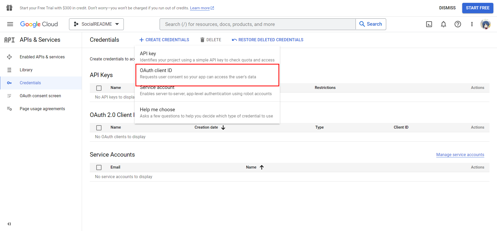

choose 

application type - `Web application`

put your callback url in `Authorized redirect URLs`

sample - `https://yourngork.app/oauth/google/callback`

click `CREATE`

and you will see pop up box save `Cliend ID` and `Client Secret`

#### now you have your `[CLIENT_ID]`, `[CLIENT_SECRET]` and `[CALLBACK_URL]` then put it in `.env`

```
GOOGLE_CLIENT_ID="YOUR_CLIENT_ID"
GOOGLE_CLIENT_SECRET="YOUR_CLIENT_SECRET"
GOOGLE_REDIRECT="YOUR_CALLBACK_URL"
```

# Git Hub Developer Account Setup

for github you only need your github account

so go to the `setting > developer settings > OAuth Apps` and click `New OAuth App`

put your ngork url

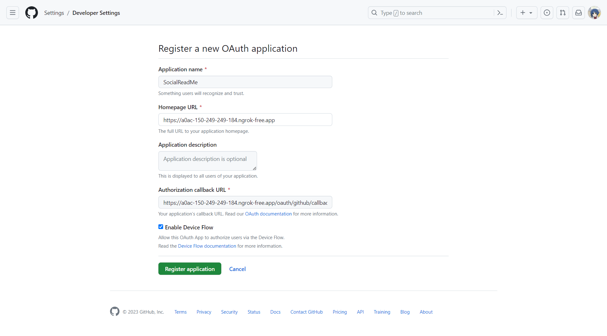

#### now you have your `[CLIENT_ID]`, `[CLIENT_SECRET]` and `[CALLBACK_URL]` then put it in `.env`

```
GITHUB_CLIENT_ID="YOUR_CLIENT_ID"
GITHUB_CLIENT_SECRET="YOUR_CLIENT_SECRET"
GITHUB_REDIRECT="YOUR_CALLBACK_URL"
```


# Setup complete

now open your terminal in your vs code

install package
```
composer install
```
clear all cache
```
php artisan optimize:clear
```
setup database in .env

```
php artisan migrate
```
and run

```
php artisan serve
```

and now open with your ngork url and main screen page should load up !!

